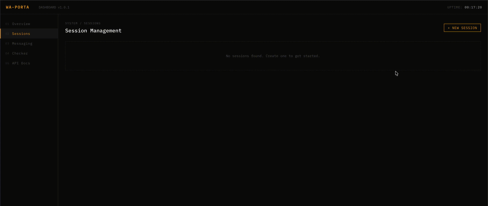

<picture>
  <source media="(prefers-color-scheme: dark)" srcset="https://storage.iniadil.dev/wa-porta/waporta-github-dark.png">
  
</picture>
<br />
<br />

[](https://waporta.net) [](https://waporta.net/docs)  [](https://www.npmjs.com/package/baileys)

A lightweight, self-hosted WhatsApp unofficial API with a built-in dashboard. Supports **multi-device**, **multi-session**, and **session-scoped incoming message webhooks** out of the box.

Built with [Hono](https://hono.dev), [Baileys](https://github.com/WhiskeySockets/Baileys), and React.

## Demo



## Quick Start

**One command to install and run:**

```bash
curl -fsSL https://storage.iniadil.dev/wa-porta/install.sh | sh
```

The script clones the repo, asks for your dashboard credentials, and starts the containers. Done.

---

**Or set it up manually in 4 steps:**

**1. Run**

```bash
git clone https://github.com/iniadil/waporta.git
cd waporta
cp .env.example .env          # set DASHBOARD_USERNAME and DASHBOARD_PASSWORD
docker compose up -d
```

**2. Get an API key**

Option A — set a static key in `.env` before starting:

```env
DEFAULT_API_KEY=wap_your_static_key_here
```

Option B — generate one from the dashboard: open `http://localhost:3000/dashboard` → log in → **API Keys** → enter a name → **Generate** → copy the key (shown once).

**3. Connect WhatsApp**

Open **Sessions** in the dashboard → create a session → scan the QR code or use a pairing code. You can also add HTTPS webhook URLs per session to receive incoming message events.

**4. Send a message**

```bash
curl -X POST http://localhost:3000/api/whatsapp/send/text \
  -H "X-API-Key: wap_your_key_here" \
  -H "Content-Type: application/json" \
  -d '{"sessionId": "my-session", "to": "6281234567890", "text": "Hello!"}'
```

> **Heads up:** A freshly connected session has a **warm-up window** (default 5 minutes) during which sends are rejected with `429`, and every recipient is checked with `isExist` first. This is intentional — it lowers the risk of WhatsApp banning the number. See [Anti-ban Guards](#anti-ban-guards).

---

## Why waporta?

- **Multi-device** — uses the latest WhatsApp multi-device protocol via Baileys; no phone needs to stay online
- **Anti-ban guards** — warm-up window after connect, per-session rate limiting, recipient `isExist` check, and typing simulation to lower the risk of WhatsApp bans
- **Multi-session** — manage multiple WhatsApp numbers from one server
- **Lightweight** — minimal dependencies, fast startup, low memory footprint
- **Dashboard included** — manage sessions, send messages, webhooks, and check numbers from the browser
- **REST API** — integrate messaging, session management, and session-scoped webhooks with any backend or automation tool
- **Session webhooks** — register multiple HTTPS URLs per session for incoming WhatsApp message events
- **Retry & notifications** — automatic retry with exponential backoff for failed deliveries, optional email/webhook alerts

---

## Setup

### Docker (Recommended)

```bash
git clone https://github.com/iniadil/waporta.git
cd waporta
cp .env.example .env
```

Edit `.env`:

```env
DASHBOARD_USERNAME=admin
DASHBOARD_PASSWORD=your-secure-password
# Optional: skip dashboard key generation by setting a static API key
DEFAULT_API_KEY=wap_your_static_key_here
```

```bash
docker compose up -d
```

Dashboard and API available at `http://localhost:3000`.

**Common commands**

```bash
PORT=8080 docker compose up -d   # custom port
docker compose logs -f            # view logs
docker compose down               # stop
git pull && docker compose up -d --build  # upgrade
```

**Persistent data** (all under `./data/` on the host)

| Path                | Contents                                            |
| ------------------- | --------------------------------------------------- |
| `wa_credentials/`   | WhatsApp session store + credentials (SQLite `database.db`) |
| `api_keys.json`     | API keys                                            |
| `webhook_urls.json` | Session webhook URLs                                |

> Back up `./data/` to preserve sessions and API keys across migrations.

<details>
<summary>Without Docker Compose</summary>

```bash
docker build -t waporta .
docker run -d \
  --name waporta \
  -p 3000:3000 \
  -v $(pwd)/data/wa_credentials:/app/wa_credentials \
  -v $(pwd)/data:/app/data \
  -e NODE_ENV=production \
  -e DASHBOARD_USERNAME=admin \
  -e DASHBOARD_PASSWORD=your-secure-password \
  --restart unless-stopped \
  waporta
```

</details>

### Without Docker

> **Use npm** (Node.js 20+). waporta pins Baileys via the npm `overrides` field and applies dependency patches with `patch-package` on `postinstall` — both are npm-specific, so `pnpm` and `yarn` will not produce a working install.

```bash
git clone https://github.com/iniadil/waporta.git
cd waporta
npm install
cp .env.example .env
# edit .env with your credentials
```

```bash
npm run dev:all    # dev: backend + dashboard (hot reload)
npm run start      # production
```

- Backend: `http://localhost:3000`
- Dashboard (dev): `http://localhost:5173`
- Dashboard (prod): `http://localhost:3000/dashboard`

---

## Authentication

waporta uses a dual-auth system:

| Caller              | Header                          | How to get                                                             |
| ------------------- | ------------------------------- | ---------------------------------------------------------------------- |
| Dashboard           | `Authorization: Bearer <token>` | Issued on login, stored in browser                                     |
| REST API / external | `X-API-Key: <key>`              | Set `DEFAULT_API_KEY` in `.env`, or generate from dashboard → API Keys |

All `/api/whatsapp/*` endpoints accept either. Requests without a valid credential receive `401 Unauthorized`.

---

## Dashboard

| Page      | Description                                                            |
| --------- | ---------------------------------------------------------------------- |
| Overview  | Session stats + quick actions                                          |
| Sessions  | Create sessions (QR / Pairing Code), manage webhook URLs, delete sessions |
| Messaging | Send text, image, or document messages                                 |
| Checker   | Check if a number is registered on WhatsApp                            |
| API Keys  | Generate and revoke API keys for external integrations                 |

QR codes are polled automatically every 2 seconds.

---

## API Reference

Base URL: `http://localhost:3000/api/whatsapp`
Interactive docs: [`https://waporta.net`](https://waporta.net) or `http://localhost:3000/doc`

### Sessions

| Method   | Path                                | Description               |
| -------- | ----------------------------------- | ------------------------- |
| `GET`    | `/sessions`                         | List all sessions         |
| `POST`   | `/sessions/:sessionId`              | Start a new session       |
| `POST`   | `/sessions/:sessionId/pairing-code` | Start via pairing code    |
| `GET`    | `/sessions/:sessionId`              | Get session status        |
| `GET`    | `/sessions/:sessionId/qr`           | Get QR code               |
| `DELETE` | `/sessions/:sessionId`              | Delete and logout session |

### Messaging

| Method | Path             | Description          |
| ------ | ---------------- | -------------------- |
| `POST` | `/send/text`     | Send a text message  |
| `POST` | `/send/image`    | Send an image        |
| `POST` | `/send/document` | Send a document/file |

### Utilities

| Method | Path                    | Description                      |
| ------ | ----------------------- | -------------------------------- |
| `GET`  | `/check?sessionId=&to=` | Check if a number is on WhatsApp |

### Webhooks

Session webhooks deliver incoming WhatsApp message events to HTTPS endpoints that you control.
Each webhook URL belongs to one session, and incoming messages are delivered only to webhook URLs registered for the matching `sessionId`.
Multiple webhook URLs can be registered for the same session.

All webhook management endpoints use the same authentication as other `/api/whatsapp/*` endpoints: `Authorization: Bearer <token>` or `X-API-Key: <key>`.

| Method   | Path                                   | Description                         |
| -------- | -------------------------------------- | ----------------------------------- |
| `POST`   | `/sessions/{sessionId}/webhooks`       | Register an HTTPS webhook URL       |
| `GET`    | `/sessions/{sessionId}/webhooks`       | List webhook URLs for one session   |
| `DELETE` | `/sessions/{sessionId}/webhooks/{id}`  | Delete one webhook URL by record id |

**Create request**

```json
{
  "url": "https://example.com/whatsapp"
}
```

`url` must be an absolute HTTPS URL, up to 2048 characters, with no fragment.

**Webhook URL record**

```json
{
  "id": "a1b2c3d4e5f6a7b8",
  "sessionId": "my-session",
  "url": "https://example.com/whatsapp",
  "normalizedUrl": "https://example.com/whatsapp",
  "enabled": true,
  "createdAt": "2024-01-01T00:00:00.000Z",
  "updatedAt": "2024-01-01T00:00:00.000Z"
}
```

Webhook management responses do not include API keys, request headers, WhatsApp credentials, or other authentication secrets.
If the same normalized URL already exists for the session, create returns `409`:

```json
{
  "error": "duplicate_webhook_url",
  "existingId": "a1b2c3d4e5f6a7b8"
}
```

**Outbound `WebhookMessagePayload`**

Each delivery is a `POST` request with a JSON body containing:

| Field         | Description                                      |
| ------------- | ------------------------------------------------ |
| `event`       | Currently `message.received`                     |
| `sessionId`   | Session that received the incoming message       |
| `messageId`   | Message identifier when available                |
| `sender`      | WhatsApp sender JID when available               |
| `recipient`   | WhatsApp recipient JID when available            |
| `timestamp`   | Message timestamp as a number or string          |
| `messageType` | Message type such as `text`, `image`, `document` |
| `content`     | Message content metadata with secrets redacted   |
| `raw`         | Raw event data with secrets redacted             |

Example payload:

```json
{
  "event": "message.received",
  "sessionId": "my-session",
  "messageId": "ABCDEF123456",
  "sender": "6281234567890@s.whatsapp.net",
  "recipient": "6289876543210@s.whatsapp.net",
  "timestamp": 1700000000,
  "messageType": "text",
  "content": {
    "text": "Hello from WhatsApp"
  },
  "raw": {
    "event": "redacted raw event data"
  }
}
```

### Examples

```bash
# Start a session
curl -X POST http://localhost:3000/api/whatsapp/sessions/my-session \
  -H "X-API-Key: wap_your_key_here"

# Send text
curl -X POST http://localhost:3000/api/whatsapp/send/text \
  -H "X-API-Key: wap_your_key_here" \
  -H "Content-Type: application/json" \
  -d '{"sessionId": "my-session", "to": "6281234567890", "text": "Hello!"}'

# Send image
curl -X POST http://localhost:3000/api/whatsapp/send/image \
  -H "X-API-Key: wap_your_key_here" \
  -H "Content-Type: application/json" \
  -d '{"sessionId": "my-session", "to": "6281234567890", "media": "https://example.com/image.jpg", "text": "Caption"}'

# Send document
curl -X POST http://localhost:3000/api/whatsapp/send/document \
  -H "X-API-Key: wap_your_key_here" \
  -H "Content-Type: application/json" \
  -d '{"sessionId": "my-session", "to": "6281234567890", "media": "https://example.com/file.pdf", "filename": "document.pdf"}'

# Check number
curl "http://localhost:3000/api/whatsapp/check?sessionId=my-session&to=6281234567890" \
  -H "X-API-Key: wap_your_key_here"

# Pairing code
curl -X POST http://localhost:3000/api/whatsapp/sessions/my-session/pairing-code \
  -H "X-API-Key: wap_your_key_here" \
  -H "Content-Type: application/json" \
  -d '{"phoneNumber": "628123456789"}'

# Delete session
curl -X DELETE http://localhost:3000/api/whatsapp/sessions/my-session \
  -H "X-API-Key: wap_your_key_here"

# Create a session webhook URL
curl -X POST http://localhost:3000/api/whatsapp/sessions/my-session/webhooks \
  -H "X-API-Key: wap_your_key_here" \
  -H "Content-Type: application/json" \
  -d '{"url": "https://example.com/whatsapp"}'

# List session webhook URLs
curl http://localhost:3000/api/whatsapp/sessions/my-session/webhooks \
  -H "X-API-Key: wap_your_key_here"

# Delete a session webhook URL
curl -X DELETE http://localhost:3000/api/whatsapp/sessions/my-session/webhooks/a1b2c3d4e5f6a7b8 \
  -H "X-API-Key: wap_your_key_here"
```

---

## Retry & Failure Notifications

When a message fails to send due to a transient network error, waporta automatically retries up to **3 times** with exponential backoff and jitter (base 3s). Connection-drop errors are **not** retried — hammering a just-disconnected socket can deepen a ban. If all retries fail, it returns a `502` response and optionally notifies you via email or webhook.

### Error behavior

| Error type | Example | Behavior |
| --- | --- | --- |
| Retryable | Transient network errors (`timeout`, `etimedout`, `econnreset`) | Retry up to 3 times with backoff + jitter |
| Non-retryable | Connection dropped/closed, session not found, invalid media, validation error | Fail immediately |
| Guard rejection | Warm-up window, rate limit, unregistered recipient | Return `422`/`429` immediately — **not** retried (see [Anti-ban Guards](#anti-ban-guards)) |

### Failed delivery response

```json
{
  "error": "delivery_failed",
  "message": "All 3 attempts failed: Session with ID: \"my-session\" Not Ready!",
  "attempts": 3
}
```

### Email notification (optional)

Add these to your `.env` to receive email alerts when delivery fails after all retries:

```env
SMTP_HOST=smtp.gmail.com
SMTP_PORT=587
SMTP_USER=you@gmail.com
SMTP_PASS=your_app_password
SMTP_FROM=waporta@yourdomain.com
NOTIFY_EMAIL=admin@yourdomain.com
```

### Failure notification webhook (optional)

Set a webhook URL to receive a `POST` request with failure details:

```env
NOTIFY_WEBHOOK_URL=https://your-endpoint.com/waporta
```

Webhook payload:

```json
{
  "sessionId": "my-session",
  "to": "6281234567890",
  "messageType": "text",
  "error": "All 3 attempts failed: Session with ID: \"my-session\" Not Ready!",
  "attempts": 3,
  "timestamp": "2026-03-26T15:10:27.000Z"
}
```

> Both notification channels are optional and can be used together. If neither is configured, retry still works — you just won't get notified.
> This failure notification webhook is separate from session webhooks, which deliver incoming WhatsApp message events per session.

---

## Anti-ban Guards

To lower the risk of WhatsApp banning a connected number, every send endpoint runs a set of checks before dispatching. Guard rejections return immediately and do **not** trigger the retry mechanism.

| Guard | Behavior | Response when blocked |
| --- | --- | --- |
| **Warm-up window** | Sends are blocked for a period after a session connects/reconnects — sending right after pairing is a strong ban signal | `429 session_warming_up` + `retryAfterMs` |
| **Rate limit** | Per-session sliding-window cap on outgoing messages | `429 rate_limited` + `retryAfterMs` |
| **Recipient check** | Non-group sends are validated with `isExist`; sending to unregistered numbers is a strong spam signal | `422 recipient_not_found` |
| **Typing simulation** | A randomized "typing" indicator is shown before each send (best-effort) | — |
| **Session not ready** | Session is reconnecting / unavailable | `503 session_unavailable` |

Group sends (`"isGroup": true`) skip the recipient check.

### Configuration

All thresholds are environment variables (defaults shown). Set any value to `0` to disable that guard.

| Variable | Default | Description |
| --- | --- | --- |
| `SEND_WARMUP_MS` | `300000` (5 min) | Block sends for this long after a session connects/reconnects |
| `SEND_RATE_MAX` | `20` | Max messages per session within the rate window |
| `SEND_RATE_WINDOW_MS` | `60000` (1 min) | Rolling window for the rate limit |
| `SEND_TYPING_MIN_MS` | `800` | Min typing-indicator duration before each send |
| `SEND_TYPING_MAX_MS` | `2500` | Max typing-indicator duration before each send |

> These guards lower ban risk but do not eliminate it. Datacenter/VPS IPs and brand-new numbers remain higher-risk — warm up new numbers gradually before sending at volume.

---

## Notes

- Phone numbers: country code without `+`, e.g. `6281234567890`
- Group messages: add `"isGroup": true` to the request body
- Session data is stored in SQLite under `wa_credentials/database.db`
- API keys are stored in `data/api_keys.json`
- Session webhook URLs are stored in `data/webhook_urls.json`
- `DEFAULT_API_KEY` in `.env` works without creating a key from the dashboard
- **Install with npm** (Node.js 20+) — the Baileys version pin (`overrides`) and dependency patches (`patch-package`) are npm-specific; `pnpm`/`yarn` will not apply them

---

## Feedback & Support

- Website & docs: [waporta.net](https://waporta.net)
- Found a bug or have a feature request? [Open an issue](https://github.com/iniadil/waporta/issues) on GitHub.
- For direct inquiries, reach out at [me@iniadil.dev](mailto:me@iniadil.dev).
