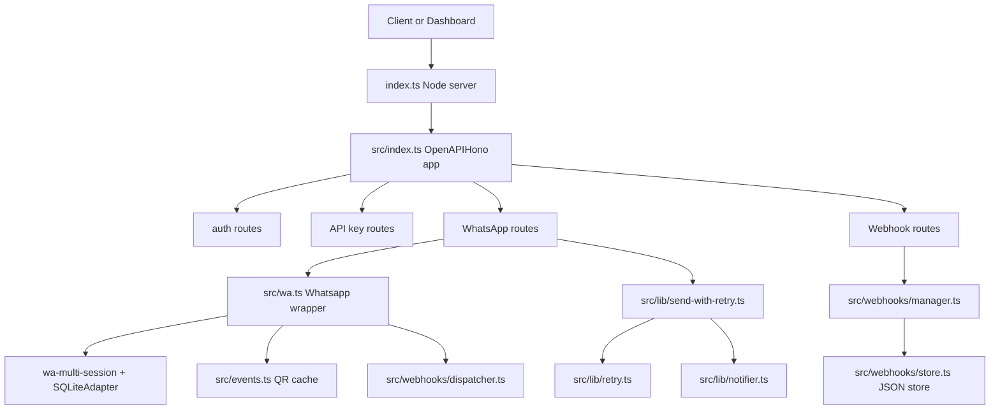
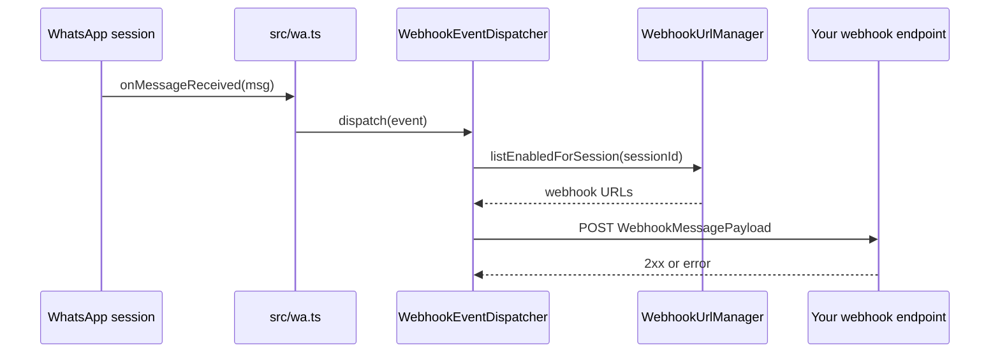

waporta is a server-first application with one runtime process. The entry process in `index.ts` creates the Node server, the Hono app in `src/index.ts` mounts every HTTP route, and specialized modules handle sessions, retries, webhooks, and persistence.

## Major Modules

- `index.ts` is the process bootstrap. It reads `PORT`, imports the default app from `src/index.ts`, and passes `app.fetch` into `@hono/node-server`.
- `src/index.ts` is the composition root. It creates `OpenAPIHono`, applies logger, pretty JSON, and CORS middleware, mounts the dashboard static build, and registers all route groups.
- `src/wa.ts` owns the WhatsApp runtime. It builds a single `Whatsapp` instance with a `SQLiteAdapter`, registers lifecycle callbacks, and forwards inbound messages into the webhook dispatcher.
- `src/routes/whatsapp.ts` is the external messaging API. It defines session endpoints, send endpoints, and the number-check endpoint with Zod schemas and OpenAPI metadata.
- `src/webhooks/*` implements webhook registration, validation, normalization, persistence, and outbound dispatch for inbound message events.
- `src/lib/*` contains resilience utilities. `retry.ts` decides whether failures are retryable, `send-with-retry.ts` applies the policy to sends, and `notifier.ts` emits optional alerts.

## Key Design Decisions

### Typed routes with OpenAPI generation

The choice of `OpenAPIHono` in `src/index.ts` and `src/routes/whatsapp.ts` means route definitions and documentation are generated from the same source. That reduces drift between runtime behavior and docs, which matters here because the API has multiple request bodies and auth schemes. The separate `scripts/gen-swagger.ts` file simply asks the app for its OpenAPI document and writes `openapi.json`; it does not define a second schema tree.

### One long-lived WhatsApp adapter

`src/wa.ts` creates one `Whatsapp` object and exports it as the module default. The routes call that shared instance for every session operation, which avoids creating isolated WhatsApp clients per request. This is important because a request/response server cannot rehydrate a QR login or websocket connection from scratch on every API call.

### Lightweight persistence with file-backed stores

API keys in `src/apikeys.ts` and webhook URLs in `src/webhooks/store.ts` are stored under `data/`. The webhook store writes to a temporary file and then renames it into place, which is a deliberate choice to avoid partial writes if the process crashes during persistence. The trade-off is that these stores are simple local files, not multi-node or multi-writer databases.

### Session-scoped webhook fan-out

The dispatcher only asks `WebhookUrlManager.listEnabledForSession(sessionId)` for the current session. That keeps inbound message delivery isolated between tenants or phone numbers, and it mirrors how sessions are created and addressed everywhere else in the API. It also means consumers must explicitly register webhook URLs for every session they care about.

## Request and Data Lifecycle

For a send request, the lifecycle is:

1. A caller hits `/api/whatsapp/send/*`.
2. `dualAuthMiddleware` in `src/middleware/auth.ts` accepts either a dashboard bearer token or an API key.
3. `src/routes/whatsapp.ts` validates the body with Zod and wraps the send call with `sendWithRetry`.
4. `sendWithRetry` calls `withRetry` from `src/lib/retry.ts`.
5. The shared `wa` instance in `src/wa.ts` sends through `wa-multi-session`.
6. If all retries fail, `NotifierRegistry.notifyAll` emits alerts and the route returns `502 delivery_failed`.

For an inbound message, the lifecycle is different:

`src/wa.ts` deliberately sends a normalized event object instead of the raw library object directly. `src/webhooks/dispatcher.ts` then redacts obvious secret-like keys such as `authorization`, `x-api-key`, `token`, and `password` before it serializes the payload. That decision limits accidental credential leakage when a message payload includes nested metadata.

## Supported Runtime Shape

The README states Node.js `18+`, while the production `Dockerfile` uses Node `20-alpine` in every stage. In practice, the local development path is Node plus npm-compatible tooling, and the production path is a single container exposing port `3000` and mounting `./data` for persistence. The React dashboard is optional during development but bundled into the production image and served under `/dashboard`.

The next pages break this architecture into concepts: [Session Lifecycle](/docs/session-lifecycle), [Dual Authentication](/docs/dual-authentication), and [Session Webhooks](/docs/session-webhooks).
