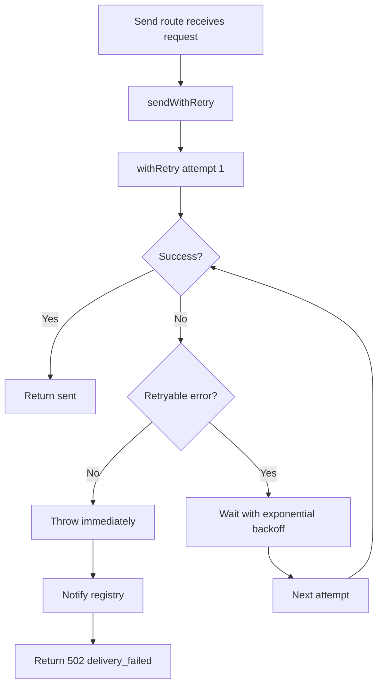

waporta treats outbound messaging as a best-effort operation that may fail transiently while a session reconnects or a network hop resets. The retry subsystem exists to absorb short-lived transport problems without forcing every API client to build its own retry loop.

## What It Is

The retry stack is composed of three modules:

- `src/lib/retry.ts` provides the generic `withRetry` function, the `RetryOptions` contract, and the error-classification helper `isRetryableWaError`.
- `src/lib/send-with-retry.ts` specializes that generic helper for WhatsApp sends and raises notifications when the retry budget is exhausted.
- `src/lib/notifier.ts` creates optional email and webhook notifiers from environment variables and fan-outs failure events through `NotifierRegistry`.

## Why It Exists

Message sends are the most failure-prone path in the API. Sessions can be disconnected, media uploads can fail, and upstream sockets can time out. By placing the retry logic behind the send routes in `src/routes/whatsapp.ts`, the server presents a stable `200 sent` or `502 delivery_failed` contract to callers while retaining the room to retry internally.

## Internal Logic

`withRetry` in `src/lib/retry.ts` loops from attempt `1` to `maxRetries`, calling the supplied async function each time. If the error is not retryable according to `opts.isRetryable`, it is thrown immediately. Otherwise, the helper waits using exponential backoff: `baseDelay * 2^(attempt - 1)`.

The retry classifier is pattern-based. `isRetryableWaError` lowercases the message and checks it against:

- Retryable fragments such as `not ready`, `disconnected`, `timeout`, `econnreset`, and `socket hang up`.
- Non-retryable fragments such as `not exist`, `invalid media`, and `validation`.

`sendWithRetry` fixes the policy to `MAX_RETRIES = 3` and `BASE_DELAY = 1000`. If all attempts fail, it builds a `FailureDetails` object and calls `registry.notifyAll(details)` without blocking the response path on notifier success.



## Basic Usage

From an API consumer’s point of view, retries are automatic.

```bash
curl -X POST http://localhost:3000/api/whatsapp/send/text \
  -H "X-API-Key: wap_local_demo_key" \
  -H "Content-Type: application/json" \
  -d '{"sessionId":"sales-bot","to":"6281234567890","text":"Order received"}'
```

Successful response:

```json
{
  "status": "sent"
}
```

If every retry fails, the route returns:

```json
{
  "error": "delivery_failed",
  "message": "All 3 attempts failed: Session not ready",
  "attempts": 3
}
```

That response shape comes directly from the `RetriesExhaustedError` handling in `src/routes/whatsapp.ts`.

## Advanced Usage

The notification side is configurable through environment variables from `.env.example`:

```bash
SMTP_HOST=smtp.gmail.com
SMTP_PORT=587
SMTP_USER=you@example.com
SMTP_PASS=app_password
SMTP_FROM=waporta@example.com
NOTIFY_EMAIL=ops@example.com
NOTIFY_WEBHOOK_URL=https://ops.example.com/waporta/failures
```

When both email and webhook settings are present, `createRegistry()` in `src/lib/notifier.ts` registers both notifiers and uses `Promise.allSettled` to notify them in parallel.

An internal usage example looks like this:

```ts
import { sendWithRetry } from './src/lib/send-with-retry.js';

await sendWithRetry({
  sessionId: 'sales-bot',
  to: '6281234567890',
  messageType: 'text',
  sendFn: () =>
    Promise.reject(new Error('socket hang up')),
});
```

That call will retry three times because `socket hang up` matches the retryable pattern list. A failure such as `invalid media url` will not be retried because it matches the non-retryable list.

<Callout type="warn">The retry classifier is based on error-message substring matching, not structured error codes. If the upstream library changes its wording, a transient failure might stop retrying or a permanent failure might retry unnecessarily until you update `RETRYABLE_PATTERNS` and `NON_RETRYABLE_PATTERNS` in `src/lib/retry.ts`.</Callout>

<Accordions>
<Accordion title="Pattern matching vs structured error codes">
The current classifier is simple because the upstream send failures come through as generic JavaScript errors. That keeps `src/lib/retry.ts` decoupled from library-specific classes, and it means the retry stack can react to plain network failures such as `ECONNRESET` without special adapters. The downside is brittleness: the contract lives in text fragments rather than stable enums. If you fork the project or upgrade `wa-multi-session`, revalidate these patterns against real logs before you assume the retry behavior is still correct.
</Accordion>
<Accordion title="Fire-and-forget notifications vs blocking the API response">
`sendWithRetry` deliberately does not fail the API response when email or webhook notifications fail. `NotifierRegistry.notifyAll` is awaited inside a `catch`, but the registry itself uses `Promise.allSettled`, logs notifier-specific failures, and lets the original messaging error remain the primary outcome. That makes sense because a message send failure is the user-facing event; losing an alert should not replace it with a different error mode. The trade-off is that you need separate observability for notifier health, because a broken alert channel will only show up in logs. If notifications are mission-critical in your environment, treat them as another service to monitor rather than assuming the API path guarantees them.
</Accordion>
</Accordions>

The practical setup for these alerts is covered in [Receive Webhooks and Alerts](/docs/guides/receive-webhooks-and-alerts).
