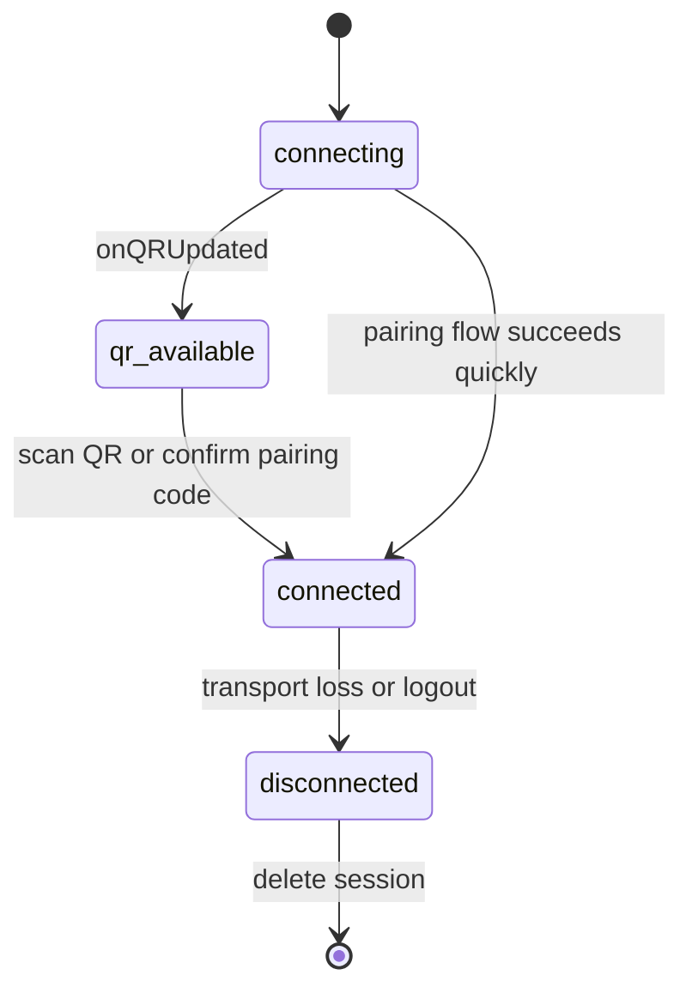

A session in waporta is the durable unit that binds one WhatsApp account to one server-side identifier such as `my-session`. Every messaging call, number check, and webhook registration hangs off that `sessionId`, so understanding the session lifecycle is the first requirement for using the API correctly.

## What It Is

waporta does not create a new WhatsApp client per HTTP request. Instead, `src/wa.ts` exports one shared `Whatsapp` runtime, and `src/routes/whatsapp.ts` asks that runtime to start, inspect, or delete named sessions. `src/events.ts` complements that runtime with a tiny in-memory QR cache so the frontend or API can poll the current QR string.

This concept exists because WhatsApp authentication is asynchronous. A client needs time to connect, produce a QR code or pairing code, wait for confirmation, and then transition into a connected state. HTTP alone is not enough; the runtime needs persistent process state.

## How It Relates To Other Concepts

- [Dual Authentication](/docs/dual-authentication) controls who can invoke session operations.
- [Delivery Retries](/docs/delivery-retries) only apply after a session is already available for sends.
- [Session Webhooks](/docs/session-webhooks) are scoped by `sessionId`, so no session means no inbound event fan-out.

## Internal Flow

The session flow is spread across three files:

- `src/routes/whatsapp.ts` defines the API endpoints:
  - `POST /sessions/{sessionId}`
  - `POST /sessions/{sessionId}/pairing-code`
  - `GET /sessions/{sessionId}`
  - `GET /sessions/{sessionId}/qr`
  - `DELETE /sessions/{sessionId}`
- `src/wa.ts` wires `wa-multi-session` callbacks:
  - `onConnecting`
  - `onConnected`
  - `onDisconnected`
  - `onQRUpdated`
  - `onMessageReceived`
- `src/events.ts` stores the latest QR string with `onQR`, returns it with `getQR`, and clears it after connection with `clearQR`.

`setPendingSession` in `src/events.ts` is currently a no-op. The code comment explains why: QR events already include the session ID, so the older placeholder state is no longer needed. That detail matters if you read older examples or fork the project and expect a separate pending-session registry.



## Basic Usage

The most direct flow is QR-based login.

```bash
curl -X POST http://localhost:3000/api/whatsapp/sessions/my-session \
  -H "X-API-Key: wap_local_demo_key"

curl http://localhost:3000/api/whatsapp/sessions/my-session/qr \
  -H "X-API-Key: wap_local_demo_key"
```

If the session has not connected yet, the second call returns:

```json
{
  "qr": "data-or-raw-qr-string"
}
```

You can then inspect the final state:

```bash
curl http://localhost:3000/api/whatsapp/sessions/my-session \
  -H "X-API-Key: wap_local_demo_key"
```

Typical connected response:

```json
{
  "sessionId": "my-session",
  "status": "connected",
  "user": {
    "id": "12345@s.whatsapp.net",
    "name": "Ops Bot"
  }
}
```

## Advanced Usage

Pairing codes remove the need to poll QR images in environments where an operator can type a short code on the phone.

```ts
const baseUrl = 'http://localhost:3000';
const apiKey = 'wap_local_demo_key';

const pairing = await fetch(
  `${baseUrl}/api/whatsapp/sessions/sales-bot/pairing-code`,
  {
    method: 'POST',
    headers: {
      'Content-Type': 'application/json',
      'X-API-Key': apiKey,
    },
    body: JSON.stringify({ phoneNumber: '6281234567890' }),
  }
).then((res) => res.json());

console.log(pairing);
```

Expected shape:

```json
{
  "status": "waiting_for_confirmation",
  "sessionId": "sales-bot",
  "pairingCode": "ABCD-EFGH"
}
```

This endpoint is implemented as a promise wrapper around `wa.startSessionWithPairingCode` in `src/routes/whatsapp.ts`. The route resolves when `onPairingCode` fires, so the HTTP response intentionally waits for the code instead of returning immediately.

<Callout type="warn">A QR string is stored only in process memory by `src/events.ts`. If the server restarts before the session is connected, the previous QR value disappears and the client must request a fresh one after the runtime emits another `onQRUpdated` event.</Callout>

<Accordions>
<Accordion title="QR polling vs pairing-code startup">
The QR endpoint is simple because it fits a polling dashboard. `src/routes/whatsapp.ts` only needs to return the latest cached string, and the frontend can refresh every few seconds without holding open a websocket. The downside is that the QR value is ephemeral and can change while the client is polling. The pairing-code route trades that polling loop for a longer request that waits until `wa.startSessionWithPairingCode` calls `onPairingCode`, which is usually easier to script in backend tooling. If you control both the operator workflow and the backend, pairing codes are often less brittle than QR polling.
</Accordion>
<Accordion title="Shared runtime vs per-request session clients">
Exporting one `wa` instance from `src/wa.ts` keeps every session in one long-lived runtime, which matches how WhatsApp connections actually behave. A per-request model would force every route to discover, reconnect, or reinitialize transport state before doing useful work. That would increase latency and make session status much harder to reason about, especially around login transitions. The current design assumes a single-node process with local persistence, which is operationally simple but not horizontally distributed. If you need multi-node scaling, the session and event model would need a shared coordination layer that the current codebase does not provide.
</Accordion>
</Accordions>

Once a session is connected, proceed to [Delivery Retries](/docs/delivery-retries) for outbound behavior or [Session Webhooks](/docs/session-webhooks) to receive inbound messages.
