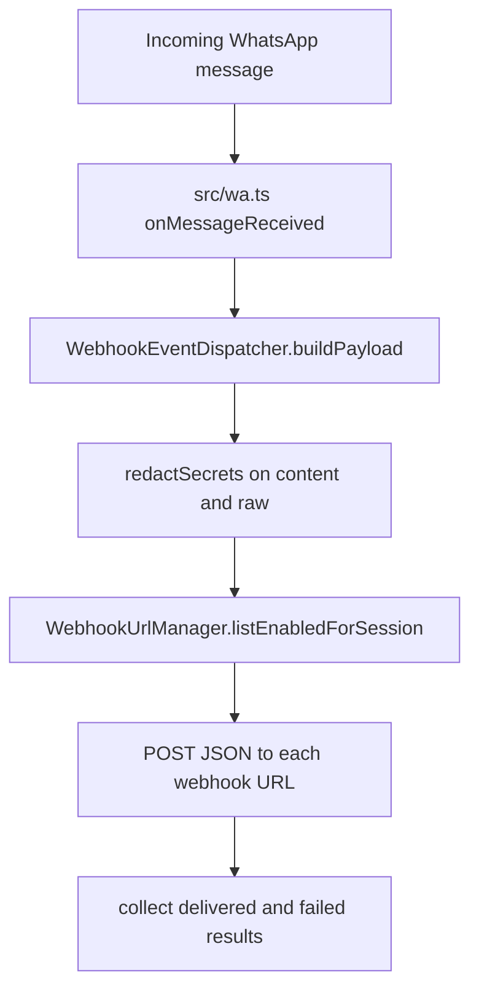

Session webhooks are the inbound half of waporta. When WhatsApp delivers a message to one of your connected sessions, waporta can POST a sanitized payload to one or more HTTPS endpoints that you registered for that specific session.

## What It Is

The webhook subsystem is split into five responsibilities:

- `src/routes/webhooks.ts` exposes the REST API for creating, listing, and deleting webhook URLs.
- `src/webhooks/url-normalization.ts` validates `sessionId` values and HTTPS URLs, and normalizes URLs for duplicate detection.
- `src/webhooks/manager.ts` performs create/list/delete operations against the store.
- `src/webhooks/store.ts` keeps records in `data/webhook_urls.json` using atomic writes.
- `src/webhooks/dispatcher.ts` builds sanitized payloads and POSTs them to registered receivers.

## Why It Exists

Without this subsystem, every consumer would need its own inbound event bridge or would have to poll the WhatsApp runtime. Session-scoped webhooks let you isolate events by phone number or tenant and keep the integration surface entirely HTTP-based.

## Internal Flow

`src/wa.ts` listens to `onMessageReceived`. Instead of forwarding the raw event object directly, it constructs an `IncomingMessageEvent` shape and calls `webhookDispatcher.dispatch(...)`. The dispatcher then:

1. Asks `WebhookUrlManager.listEnabledForSession(sessionId)` for active URLs.
2. Builds a `WebhookMessagePayload` with `event`, `sessionId`, `messageId`, sender and recipient fields, and a redacted `raw` object.
3. Serializes the payload once.
4. Sends parallel `POST` requests to each URL with a `10_000` millisecond abort timeout.
5. Tracks `attempted`, `delivered`, and `failed` in a `WebhookDispatchResult`.



## How It Relates To Other Concepts

- It depends on [Session Lifecycle](/docs/session-lifecycle) because every record is attached to a `sessionId`.
- It depends on [Dual Authentication](/docs/dual-authentication) because the management routes are mounted under `/api/whatsapp/*`.
- It is separate from [Delivery Retries](/docs/delivery-retries): outbound sends retry, inbound webhook dispatch does not.

## Basic Usage

Register a webhook for one session:

```bash
curl -X POST http://localhost:3000/api/whatsapp/sessions/sales-bot/webhooks \
  -H "X-API-Key: wap_local_demo_key" \
  -H "Content-Type: application/json" \
  -d '{"url":"https://example.com/incoming/whatsapp"}'
```

Response:

```json
{
  "id": "a1b2c3d4e5f6a7b8",
  "sessionId": "sales-bot",
  "url": "https://example.com/incoming/whatsapp",
  "normalizedUrl": "https://example.com/incoming/whatsapp",
  "enabled": true,
  "createdAt": "2026-05-06T00:00:00.000Z",
  "updatedAt": "2026-05-06T00:00:00.000Z"
}
```

List the current URLs:

```bash
curl http://localhost:3000/api/whatsapp/sessions/sales-bot/webhooks \
  -H "X-API-Key: wap_local_demo_key"
```

## Advanced Usage

A realistic receiver should validate the event type, store the message, and return a fast `2xx` response so waporta does not hit the 10-second timeout.

```ts
import { Hono } from 'hono';

const app = new Hono();

app.post('/incoming/whatsapp', async (c) => {
  const payload = await c.req.json();

  if (payload.event !== 'message.received') {
    return c.json({ error: 'unsupported event' }, 400);
  }

  console.log('session', payload.sessionId);
  console.log('sender', payload.sender);
  console.log('messageType', payload.messageType);

  return c.json({ ok: true }, 200);
});

export default app;
```

URL validation is stricter than it first appears. `validateWebhookUrl` in `src/webhooks/url-normalization.ts` rejects non-string values, blank strings, lengths above `2048`, non-absolute URLs, non-HTTPS schemes, missing hostnames, and URLs with fragments. `normalizeUrl` lowercases scheme and host, removes the default HTTPS port, preserves query strings, and strips the trailing slash from the empty-root path. That means these two inputs are treated as duplicates for the same session:

```text
https://Example.com/
https://example.com
```

<Callout type="warn">Inbound webhook dispatch is best effort. `WebhookEventDispatcher.dispatch` logs failures and returns a result object, but it does not retry failed webhook deliveries or queue them for later replay. If your receiver is temporarily down, that specific inbound event can be lost.</Callout>

<Accordions>
<Accordion title="Session-scoped URLs vs a global event bus">
The code only stores webhook URLs under a specific `sessionId`, which keeps tenant or number isolation straightforward. A session can have multiple receivers, but it cannot accidentally receive another session’s traffic because `WebhookUrlManager.listEnabledForSession` filters strictly by the current session. This is a better fit for multi-number operational tooling than a single global webhook endpoint with custom routing rules inside it. The trade-off is more configuration: if you run ten sessions and want the same receiver for all of them, you still need ten registrations. The source code favors explicit isolation over a more abstract subscription model.
</Accordion>
<Accordion title="JSON file storage vs database-backed webhook management">
`WebhookUrlStore` is easy to run because it only needs the local filesystem and creates `data/webhook_urls.json` automatically. The store also serializes writes through a promise tail and persists via temp-file rename, which is good enough for a single-node deployment. A database would add operational complexity that this project deliberately avoids. The trade-off is that the current design is not suitable for multiple application instances writing the same file over a shared volume. If you scale beyond one process, the store and manager modules are the first place that need redesign.
</Accordion>
</Accordions>

The end-to-end setup, including a real receiver example and failure alerts, is covered in [Receive Webhooks and Alerts](/docs/guides/receive-webhooks-and-alerts).
